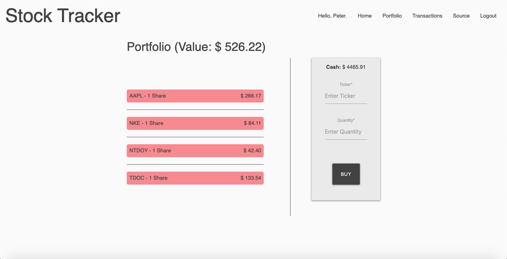

# Stock Tracker

## Video Presentation

Coming soon...

## Deployed Web App

<https://stock-tracker.herokuapp.com>

## Description

Web app that allows users to buy shares, review their past transactions, and keep track of the performance of their mock portfolio in real time.

MVP completed in 10 days as a solo project for the NYC Tech Talent Pipeline.

## Tech Stack

Built using Node.js, Express, PostgreSQL, and Sequelize on the backend, React, Redux, and Materialize on the frontend, and utilizes the IEX Cloud API.

## Dev Team

* Tal Luigi ([LinkedIn](https://www.linkedin.com/in/talluigi) | [GitHub](https://github.com/luigilegion))
